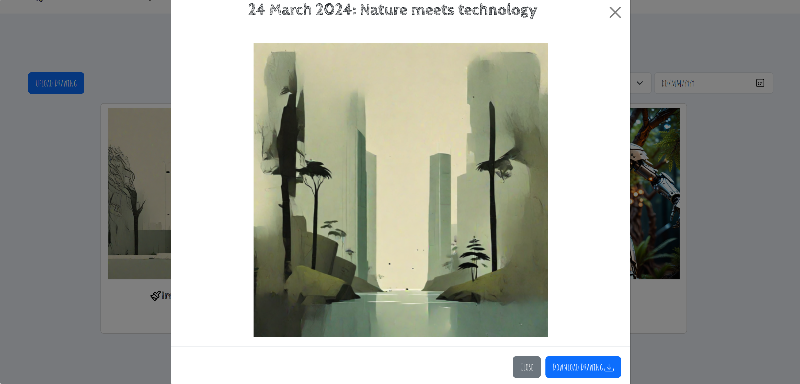

# DrawingOfTheDay
This is a Django, Django Rest Framework, and React-based website where authorized users can upload drawings based on the daily prompt. Other users, upon logging in, can interact with these images by liking and disliking them.

Home Page

Login

Profile Page

Upload Drawing

Image Modal

